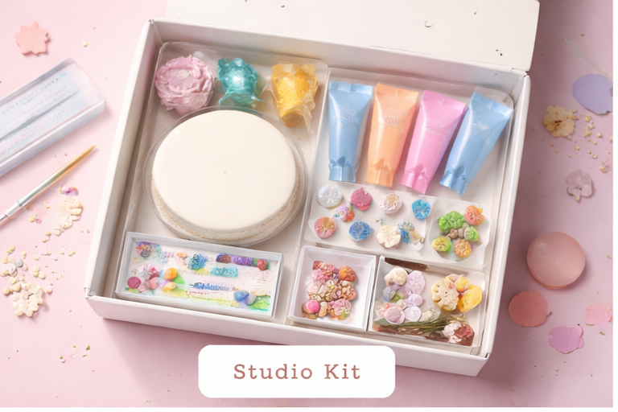
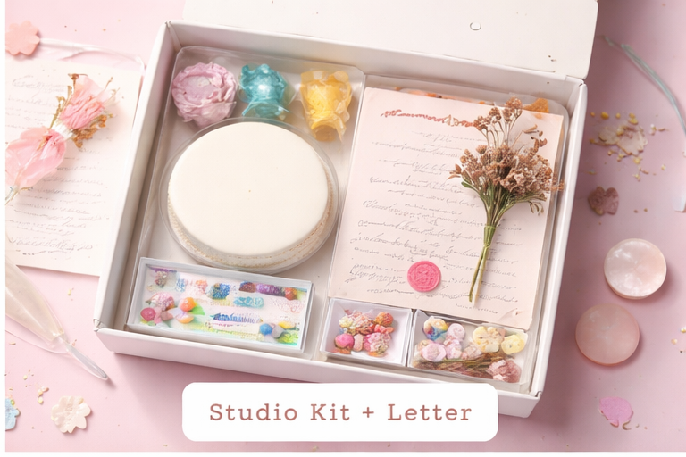
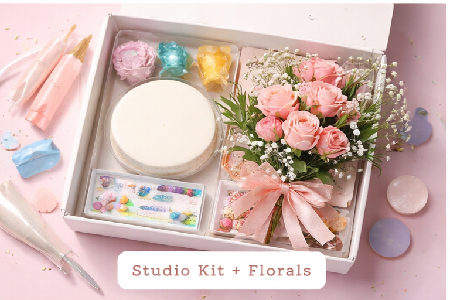
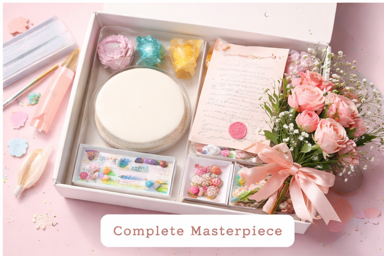

# heavenlyloaf.github.io

<html lang="en">
<head>
<meta charset="UTF-8">
<title>Paint By Pastries</title>

</head>

<body>

<header>🎨 Paint By Pastries</header>

<nav>
    <button onclick="showSection('home')">Store</button>
    <button onclick="showSection('about')">About</button>
    <button onclick="showSection('contact')">Contact</button>
    <button onclick="showSection('location')">Find Us</button>
</nav>

<!-- STORE -->

    <h2>Our Bento Kits 🎂</h2>
    

        

            
            
Studio Kit

            
₱100

            <button onclick="addToCart('Studio Kit',100)">Add</button>
        

        

            
            
Studio Kit + Letter

            
₱125

            <button onclick="addToCart('Studio Kit + Letter',125)">Add</button>
        

        

            
            
Studio Kit + Florals

            
₱175

            <button onclick="addToCart('Studio Kit + Florals',175)">Add</button>
        

        

            
            
Complete Masterpiece

            
₱200

            <button onclick="addToCart('Complete Masterpiece',200)">Add</button>
        

    

<!-- ABOUT -->

    

        <h2>About Us 💕</h2>
        
Paint By Pastries is a creative dessert experience where you design your own cake.

    

<!-- CONTACT -->

    

        <h2>Contact 📩</h2>
        
Instagram: @paintbypastries

    

<!-- LOCATION -->

    

        <h2>Find Us 📍</h2>
        <iframe src="https://maps.google.com/maps?q=Pamantasan%20ng%20Lungsod%20ng%20Maynila&output=embed"></iframe>
    

<!-- CHECKOUT PAGE -->

    

        <h2>Checkout 🧾</h2>
        

        
<strong>Total: ₱0</strong>

        <button onclick="placeOrder()" class="checkout-btn">Place Order</button>
    

<!-- CART -->

    <h3>🛒 Cart</h3>
    

    
<strong>Total: ₱0</strong>

    <button class="checkout-btn" onclick="goToCheckout()">Checkout</button>

</body>
</html>
